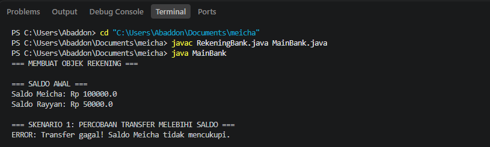
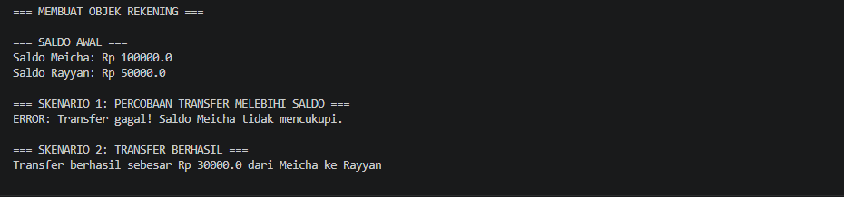
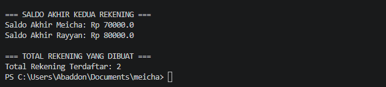

# Sistem Informasi Akun Bank (Rekening)

Program simulasi sederhana menggunakan bahasa pemrograman **Java** yang menerapkan konsep dasar Object-Oriented Programming (OOP) yaitu **Enkapsulasi** dan **Static Keyword**.

---

## 🛠️ Fitur Utama & Validasi

1. **Enkapsulasi (Encapsulation)**
   * Semua atribut (`noRekening`, `namaPemilik`, `saldo`) bersifat `private` untuk menjaga keamanan data.
   * Akses dan perubahan data dilakukan secara terkontrol melalui *getter* dan *setter*.

2. **Static Variable**
   * Menggunakan variabel `public static int totalRekening` untuk menghitung jumlah objek rekening yang berhasil dibuat secara keseluruhan.

3. **Validasi Saldo Awal (Constructor)**
   * Pembuatan rekening memerlukan saldo awal minimal **Rp 50.000**.
   * Jika saldo awal kurang dari Rp 50.000, program akan menampilkan pesan error dan secara otomatis mengatur saldo menjadi **0**.

4. **Validasi Transaksi Transfer**
   * Mencegah transfer jika nominal transfer bernilai nol atau negatif.
   * Mencegah transfer jika saldo pengirim tidak mencukupi untuk melakukan transaksi.

---

## 📁 Struktur File

* `RekeningBank.java` : Menangani logika bisnis, enkapsulasi data, serta validasi transaksi.
* `MainBank.java` : Class utama untuk menguji skenario program (membuat akun, simulasi error transfer, transfer berhasil, dan menampilkan total rekening).
* `README.md` : Dokumentasi proyek.

---

## 🚀 Cara Menjalankan Program

 Buka Terminal atau PowerShell di folder proyek, lalu jalankan perintah berikut secara berurutan:

```bash
# 1. Kompilasi kedua file Java
javac RekeningBank.java MainBank.java

# 2. Jalankan program utama
java MainBank

## 📸 Screenshot Hasil Running



## 📸 Screenshot Hasil Running



## 📸 Screenshot Hasil Running


